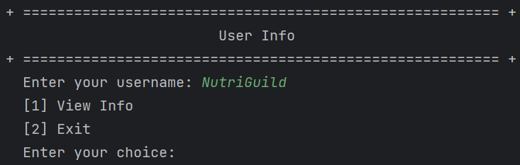
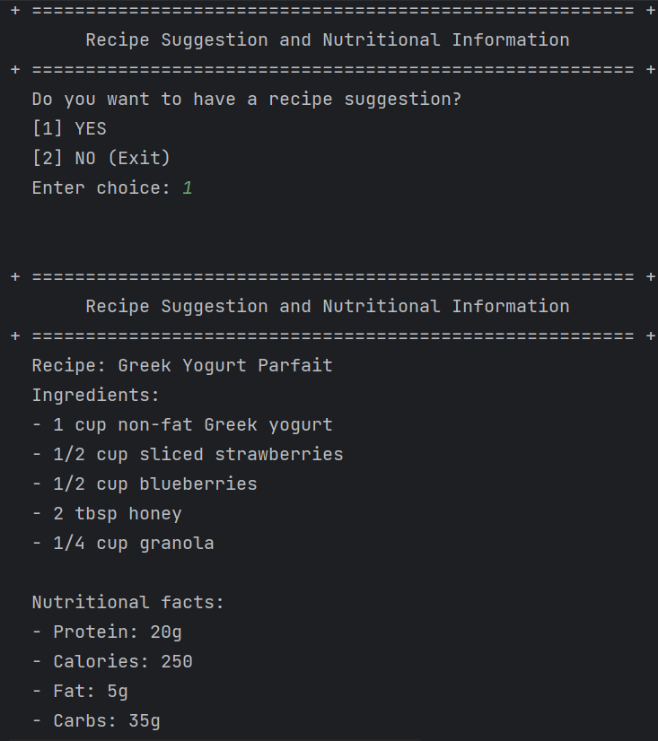
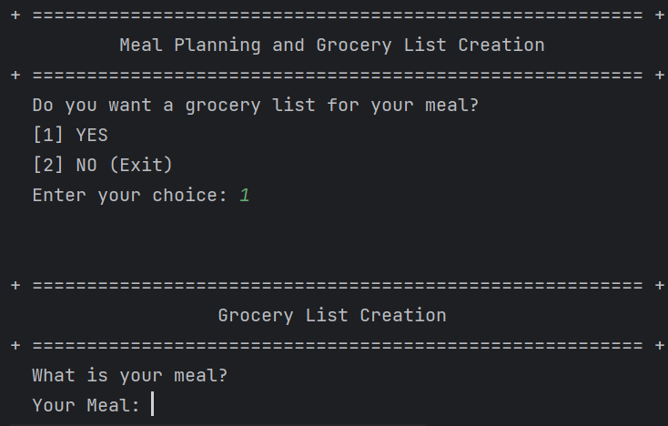
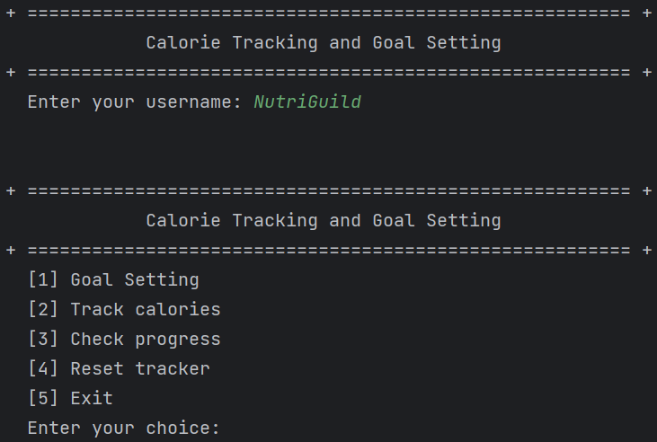
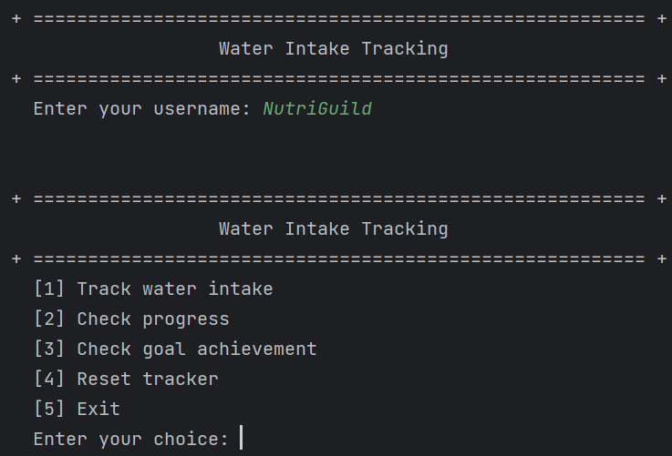
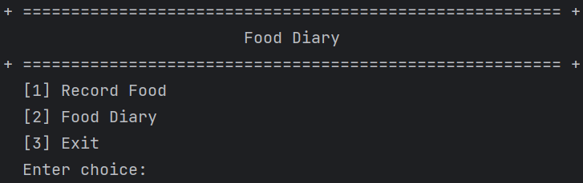

<!--the GIF we used was made by us-->

    

______________________________________________________________________
### :warning: PLEASE USE DARK MODE
<h3><b>🗂 Table of Contents</b></h3>

<ul>
  <li><a href="#introduction">Introduction</a></li>
  <li><a href="#objectives">Objectives</a></li>
  <li><a href="#scope">Scope</a></li>
  <li><a href="#key-features">Key Features</a></li>
  <li><a href="#team">Team</a></li>
  <li><a href="#conclusion">Conclusion</a></li>
  <li><a href="https://www.youtube.com/watch?v=-ELaBJ0Zhb8">Video</a></li>
</ul>

______________________________________________________________________
<h3 id="introduction"><b>📄 Introduction</b></h3>

      This is a project proposal for **`CS121 - Advanced Computer Programming`**, which is being developed by **`NutriGuild`** from **`CS-1202`**. The purpose of this project is to create a personalized nutrition and meal planning system that provides users with customized nutrition plans and meal recommendations based on their individual health goals and dietary preferences. The goal of the system is to help users make healthier food choices and improve their overall health and well-being. In this proposal, we will provide an overview of the project, including its objectives, scope, and key features.
______________________________________________________________________
<h3 id="objectives"><b>🔗 Objectives</b></h3>
<h4> The objectives of this project are:</h4>

🔴 To store and manage their personal information, including age, weight, height, and sex, which can be used to calculate and track their BMI (Body Mass Index), with the additional capability to view and update this information as needed.

🟡 To create a system that offers recipe suggestions and provides nutritional information, allowing users to choose whether or not they want a recipe suggestion.

🟢 To implement a meal planning and grocery list creation that utilizes OpenAI's API to generate a grocery list in bullet form based on the user's input meal.

🔵 To develop a calorie tracking and goal setting that allows users to set their calorie goals, track consumed calories, check progress towards the goal, reset the tracker, and save progress.

🟣 To develop a water intake tracking that allows users to track their daily water consumption, check their progress, evaluate goal achievement, and reset the tracker.

🟠 To allow users to record and view their meals along with the date.
______________________________________________________________________
<h3 id="scope"><b>🔎 Scope</b></h3>
<h4>The scope of this project includes:</h4>

📌 Sustainable Development Goal 3 is one of the 17 Sustainable Development Goals established by the United Nations in 2015. The official wording is: <i> "To ensure healthy lives and promote well-being for all at all ages." </i> The Sustainable Development Goal (SDG) that is addressed by creating a personalized nutrition and meal planning system is <b> `SDG 3: Good Health and Well-being` </b>. The personalized nutrition and meal planning system can help individuals make healthier food choices and improve their overall health and well-being. Additionally, the system can be used by healthcare professionals to create customized nutrition plans for their clients and patients, thereby promoting good health and well-being.

______________________________________________________________________
<h3 id="key-features"><b>🔑 Key Features</b></h3>
<h4> The following are the key features of the project:<h4>

  
  
<h4> 💡 User Info </h4>

  
    

        • In the User Info option (option 1), users enter their username. They are presented with two options: View Info and Exit. If they choose to view their info, their personal information is displayed. Users can update their information individually, and the changes are automatically saved.
  

  
  
<h4> 💬 Recipe Suggestion and Nutritional Information </h4>

  
    

        • Option 2 allows users to request a random recipe. The recipe includes a set of ingredients and brief nutritional facts.  
  

  
<h4>📝 Meal Planning and Grocery List Creation </h4>

  
    

  
        • Option 3 asks users if they want a grocery list for a specific meal. If they choose option 1, they are prompted to select a meal for which they want a grocery list. With the assistance of AI, the system automatically generates the list in bullet point format.

  
  
<h4>📈 Calorie Tracking and Goal Setting </h4>

  
    

  
        • Option 4 offers five modes: Goal Setting, Track Calories, Check Progress, and Reset Tracker. In the Goal Setting mode, the user's BMR is displayed based on their data. Track Calories allows users to enter the amount of calories consumed. Check Progress monitors the remaining calories that need to be consumed. Reset Tracker restores the target calories or BMR to its default value.

  
  
<h4> 💧 Water Intake Tracking </h4>

  
    

  
        • Option 5 tracks the user's water intake. It includes Track Water Intake, Check Progress, Check Goal Achievement, and Reset Tracker. Track Water Intake prompts users to enter the amount of water consumed. The entered amount is compared to the required water intake per day, which is 1,896 mL, in the Check Progress section. Check Goal Achievement displays the remaining amount of water that needs to be consumed on a particular day. Reset Tracker allows users to reset the target water intake.

  
<h4>📖 Food Diary </h4>

  
    

  
        • The last option enables users to input the food they consumed on a particular date. This mode has two options: Record Food and Food Diary. In Record Food, users enter the date in the format Month-Day-Year. If the user enters the wrong sequence, an error message is displayed, allowing them to correct the date. Next, users choose between breakfast, lunch, snack, or dinner and input the corresponding food items. The Food Diary option displays the entered data, allowing users to delete specific items from the list and save the changes. 

______________________________________________________________________
<h3 id="team"><b>👥 Team</b></h3>
<h4> The following individuals will be working on this project:</h4>
  
🐔  BARICAN, John Andrei A.  
🐻  GENIL, Gemma Rose L.  
🐷  GUINOBAN, Glenn M.  
:shipit:  LALONGISIP, Darlyne Grace M.
______________________________________________________________________
<h3 id="conclusion"><b>💬 Conclusion</b></h3>

       In conclusion, PROJECT "EATWELL" offers a comprehensive solution that aims to improve nutritional intake, facilitate weight management, simplify meal planning, increase awareness of dietary habits, enhance adherence to dietary goals, improve health outcomes, and provide an enhanced user experience. By incorporating various features such as personalized information storage, recipe suggestions, meal planning, calorie tracking, water intake tracking, and meal logging, "EATWELL" strives to empower users in making informed choices and achieving their health and wellness goals. 
______________________________________________________________________
<h3 align="center">
It is a pleasure to have the opportunity to share our project ideas with you. We are hopeful that our proposal will meet your expectations, and we thank you for considering it.  
  EATWELL😋
    
 
<h4 align="center">NutriGuild | CS-1202</h4>
</h3>
